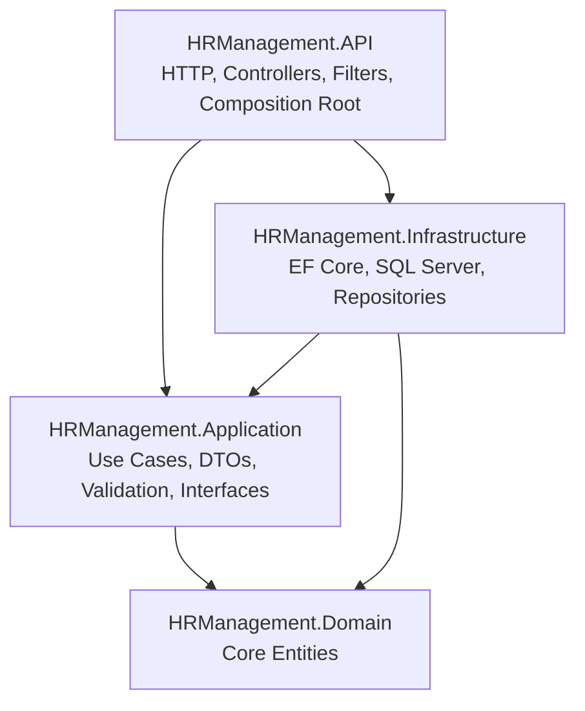

# HR Management API — Clean Architecture

[](https://dotnet.microsoft.com/)
[](https://learn.microsoft.com/aspnet/core/)
[](https://learn.microsoft.com/ef/core/)
[](https://www.microsoft.com/sql-server/)
[](#architecture)

An educational HR Management REST API built with **ASP.NET Core 10** and **Clean Architecture**. The project is developed as companion source code for a YouTube course and demonstrates how to organize a maintainable .NET solution with clear separation of concerns.

The current API manages **departments** and **job titles**, including validation, business rules, persistence, consistent responses, and interactive API documentation.

## Features

- Department management: list, retrieve, create, update, and deactivate.
- Job title management: list, retrieve, create, update, and deactivate.
- Clean Architecture with independently focused projects.
- Repository and service abstractions.
- FluentValidation-based request validation.
- Business-rule checks such as unique department names and job titles.
- Consistent success and error response envelopes.
- Centralized validation responses and HTTP status mapping.
- Entity Framework Core with SQL Server.
- Code-first database migrations.
- OpenAPI document generation with Swagger UI.
- Async operations with cancellation-token support.

## Architecture



| Project | Responsibility |
| --- | --- |
| `HRManagement.Domain` | Core business entities with no infrastructure dependencies. |
| `HRManagement.Application` | Application services, DTOs, validators, result models, and repository contracts. |
| `HRManagement.Infrastructure` | EF Core `DbContext`, entity configurations, migrations, and repository implementations. |
| `HRManagement.API` | Controllers, API responses, validation filters, OpenAPI, and dependency composition. |

## Tech Stack

- .NET 10 / C#
- ASP.NET Core Web API
- Entity Framework Core 10
- SQL Server / LocalDB
- FluentValidation 12
- Built-in ASP.NET Core OpenAPI
- Swagger UI

## Project Structure

```text
HRManagement/
├── HRManagement.API/
│   ├── Common/Responses/
│   ├── Controllers/
│   ├── Filters/
│   └── Program.cs
├── HRManagement.Application/
│   ├── Common/
│   ├── DTOs/
│   ├── Mappings/
│   ├── Repositories/
│   ├── Services/
│   └── Validators/
├── HRManagement.Domain/
│   └── Entities/
├── HRManagement.Infrastructure/
│   ├── Configurations/
│   ├── Persistence/Migrations/
│   └── Repositories/
└── HRManagement.slnx
```

## Getting Started

### Prerequisites

- [.NET 10 SDK](https://dotnet.microsoft.com/download/dotnet/10.0)
- SQL Server, SQL Server Express, or LocalDB
- Visual Studio, JetBrains Rider, VS Code, or another .NET-compatible editor
- Optional: EF Core CLI tools

```bash
dotnet tool install --global dotnet-ef --version 10.0.10
```

### 1. Clone the repository

```bash
git clone https://github.com/shady78/HrProjectCleanArchitectureOnYoutube.git
cd HrProjectCleanArchitectureOnYoutube
```

### 2. Restore dependencies

```bash
dotnet restore HRManagement.slnx
```

### 3. Configure the database

The development configuration uses SQL Server LocalDB:

```json
{
  "ConnectionStrings": {
    "DefaultConnection": "Server=(localdb)\\MSSQLLocalDB;Database=HRManagementDb;Trusted_Connection=True;TrustServerCertificate=True;"
  }
}
```

Update `HRManagement.API/appsettings.Development.json` if you use a different SQL Server instance. Do not commit production credentials; use environment variables or .NET User Secrets instead.

### 4. Apply migrations

```bash
dotnet ef database update \
  --project HRManagement.Infrastructure \
  --startup-project HRManagement.API \
  --context ApplicationDbContext
```

From Visual Studio Package Manager Console, the equivalent command is:

```powershell
Update-Database `
  -Project HRManagement.Infrastructure `
  -StartupProject HRManagement.API `
  -Context ApplicationDbContext
```

### 5. Run the API

```bash
dotnet run --project HRManagement.API
```

With the included development launch profiles, Swagger UI is available at:

- `https://localhost:7277/swagger`
- `http://localhost:5090/swagger`

The generated OpenAPI document is available at `/openapi/v1.json` in the Development environment.

## API Endpoints

### Departments

| Method | Endpoint | Description |
| --- | --- | --- |
| `GET` | `/api/departments` | Get all departments. |
| `GET` | `/api/departments/{id}` | Get a department by ID. |
| `POST` | `/api/departments` | Create a department. |
| `PUT` | `/api/departments/{id}` | Update a department. |
| `DELETE` | `/api/departments/{id}` | Deactivate a department. |

### Job Titles

| Method | Endpoint | Description |
| --- | --- | --- |
| `GET` | `/api/jobtitles` | Get all job titles. |
| `GET` | `/api/jobtitles/{id}` | Get a job title by ID. |
| `POST` | `/api/jobtitles` | Create a job title. |
| `PUT` | `/api/jobtitles/{id}` | Update a job title. |
| `DELETE` | `/api/jobtitles/{id}` | Deactivate a job title. |

## API Response Format

Successful and failed requests share a predictable envelope:

```json
{
  "success": true,
  "message": "Departments retrieved successfully.",
  "data": [],
  "errors": null
}
```

Validation and business errors use the same structure with `success` set to `false` and details included in `errors`.

## Creating a Migration

```bash
dotnet ef migrations add MigrationName \
  --project HRManagement.Infrastructure \
  --startup-project HRManagement.API \
  --context ApplicationDbContext \
  --output-dir Persistence/Migrations
```

Package Manager Console equivalent:

```powershell
Add-Migration MigrationName `
  -Project HRManagement.Infrastructure `
  -StartupProject HRManagement.API `
  -Context ApplicationDbContext `
  -OutputDir Persistence\Migrations
```

## Learning Goals

This repository is intended to demonstrate:

- How dependencies flow in Clean Architecture.
- How to keep business use cases independent from HTTP and database concerns.
- How to register services per layer using dependency-injection extensions.
- How to implement validation and business rules at the application boundary.
- How to use EF Core configurations, repositories, and migrations in an infrastructure layer.
- How to expose consistent REST responses from an ASP.NET Core API.

## Contributing

Issues and pull requests are welcome. If you are following the YouTube course, feel free to use the repository for learning, experimentation, and discussion.

## Author

Created by [Shady Khalifa](https://github.com/shady78).
